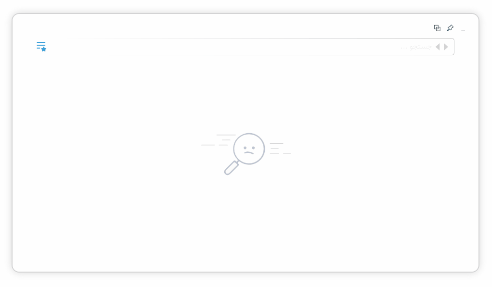

[](https://github.com/alireza-rezaee/Vajehbaz/releases/latest)
[](https://github.com/alireza-rezaee/Vajehbaz/releases/latest)
[](./LICENSE.md)
 
# واژه‌باز

**[واژه‌باز](https://alireza-rezaee.github.io/Vajehbaz)** با جستجویِ سریع در لغت‌نامه‌هایِ معتبرِ فارسی کمک می‌کند زیباتر بنویسید و اسیرِ واژه‌هایِ تکراری نشوید. با این برنامه می‌توانید مترادف و متضادِ کلماتِ فارسی را پیدا کنید. بینِ حجمِ عظیمی از اشعارِ فارسی جستجو کنید. از سرهم‌نویسی یا جدانویسیِ کلمات (کتابخانه یا کتاب‌خانه) مطلع شوید. معادلِ فارسیِ کلمات بیگانه را پیدا کنید. این برنامه نیاز به مراجعه به فرهنگ‌هایِ چاپی را تا حدِ زیادی کاهش می‌دهد و برای کسانی که به زیبانوشتن اهمیت می‌دهند کاربردهایِ فراوانی دارد.



## ساخت

```powershell
PS> Set-Location tools

# Prerequisites preparation
PS tools> ./GetNetRuntimes.ps1
PS tools> ./GetInnoSetup.ps1

# Build Setups
PS tools> ./BuildSetups.ps1
```
